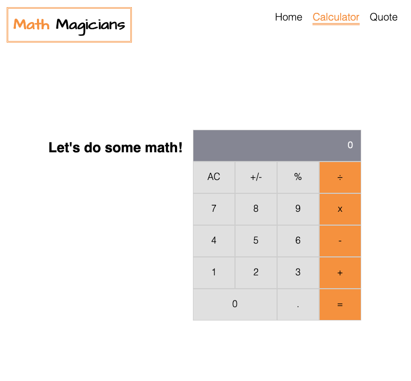

# Math magicians

> "Math magicians" is a website for all fans of mathematics.

It is a Single Page App (SPA) that allows users to:

- Make simple calculations.
- Read a random math-related quote.

## Built With

- React
- Webpack
- HTML/CSS/JS

## Live Demo

[Live Demo Link](https://jaflih.github.io/MathMagicians/)
[Netlify Link](https://festive-perlman-39446f.netlify.app/)
[Heroku Link](https://math-magician-mj.herokuapp.com/)

## Getting Started

In the project directory, you can run:

### Install

`npm install`

Install the app with its dependencies.

### Runs the app in the development mode

`npm start`

Open [http://localhost:3000](http://localhost:3000) to view it in your browser.

The page will reload when you make changes.\
You may also see any lint errors in the console.

### Run tests

`npm test`

Launches the test runner in the interactive watch mode.

### Deployment

`npm run build`

Builds the app for production to the `build` folder.\
The build is minified and the filenames include the hashes.\
Your app is ready to be deployed!

## Authors

👤 **JihaneH**

- GitHub: [@jaflih](https://github.com/jaflih)
- LinkedIn: [@jaflih](https://www.linkedin.com/in/jaflih/)
- Twitter: [@j_aflih](https://twitter.com/j_aflih)

👤 **Tresor Sawasawa**

- GitHub: [@tresorsawasawa](https://github.com/tresorsawasawa)
- Twitter: [@tresorsawasawa](https://twitter.com/TresorSawasawa)
- LinkedIn: [Trésor Sawasawa](https://www.linkedin.com/in/tr%C3%A9sor-sawasawa-43745320b/)

## 🤝 Contributing

Contributions, issues, and feature requests are welcome!

Feel free to check the [issues page](../../issues/).

## Show your support

Give a ⭐️ if you like this project!

## Acknowledgments

- Hat tip to anyone whose code was used
- Inspiration
- etc

## 📝 License

This project is [MIT](./MIT.md) licensed.
